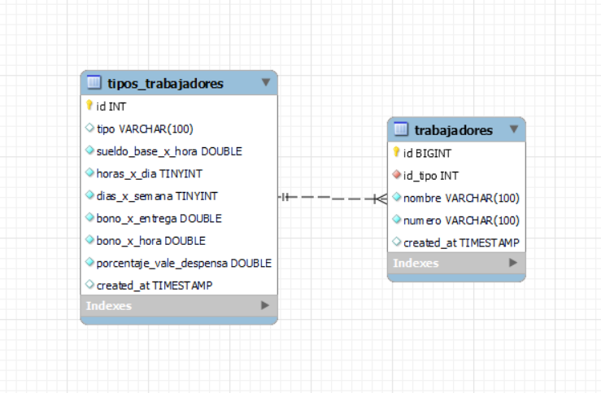
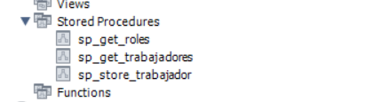

# RinkuApp

## Deploy App

1. Instalar Docker y Docker-Compose (Docker Desktop en windows)
2. Ubicarse en el directorio raiz de este proyecto y correr el siguiente comando: `docker-compose up -d`
3. Acceder a la siguiente liga para ver el proyecto: [http://localhost:8080/](http://localhost:8080)

## Frontend

El proyecto fue desarrollado con Angular y esta conformado por 3 secciones que se muestran a continuación:

1. Trabajadores:

2. Registro de trabajador:

3. Calculo de pagos:

## Backend

El proyecto consite en una API REST que fue desarrollada en nodejs utilizando express como framework, typescript como lenguaje y MVC como patron de diseño.

Los endpoint utilizados en el proyecto son los siguientes:

GET:
1. http://localhost:2002/api/v1/trabajadores/roles
2. http://localhost:2002/api/v1/trabajadores

POST:
1. http://localhost:2002/api/v1/trabajadores

    `
    {
        "nombre": "Juan",
        "numero": "0001",
        "id_tipo": 1
    }
    `

## Database

Se utilizo mysql como motor de base de datos y se puede encontrar el `dump` de la base de datos en la carpeta dump de este proyecto, se utilizaron procedimientos almacenados para interactuar con las tablas.

Diagrama de Entidad - Relación:

Procedimientos utilizados:

